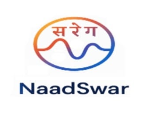
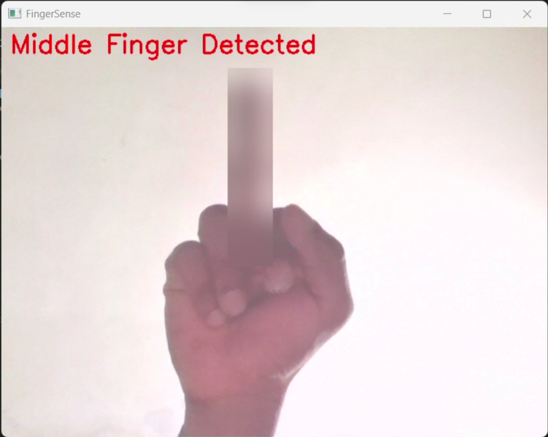

<!-- 
  ╔══════════════════════════════════════════════════════════════════════════════╗
  ║                    GitHub Profile README for Sushrutha Nayak                 ║
  ║                  Glassmorphic design with dark theme and indigo accents      ║
  ╚══════════════════════════════════════════════════════════════════════════════╝
  
  MAINTAINABILITY GUIDE:
  ----------------------
  This README is structured to mirror the site-config.js organization for easy updates.
  
  CONTENT STRUCTURE:
  1. Header Section - Name, title, social links, visitor counter
  2. About Section - Introduction and current focus
  3. Skills Section - Four categories (Core, Languages, Domains, Tools)
  4. Projects Section - Featured projects with images and tech tags
  5. Certifications Section - Cloud and Programming certifications
  6. GitHub Stats Section - Dynamic statistics (auto-updating)
  7. Connect Section - Social links and call-to-action
  8. Footer Section - Credits and metadata
  
  UPDATING CONTENT:
  - Skills: Update in site-config.js and sync here (see Skills Section)
  - Projects: Update in site-config.js and sync here (see Projects Section)
  - Certifications: Update in site-config.js and sync here (see Certifications Section)
  - Social Links: Update in site-config.js and sync here (see Header/Connect Sections)
  - Colors: All use consistent palette (see Color Palette below)
  
  COLOR PALETTE (from portfolio):
  - Primary Background: #0a0a0a (near-black)
  - Primary Accent: #6366f1 (indigo)
  - Light Accent: #818cf8, #a5b4fc (light indigo shades)
  - Text Primary: #e2e2e2 (light gray)
  - Text Secondary: #9ca3af (gray-400)
  - Category Colors:
    * Core/Indigo: #6366f1
    * Languages/Purple: #a855f7
    * Domains/Green: #10b981
    * Tools/Orange: #f97316
  
  BADGE URL PATTERNS:
  - Shields.io: https://img.shields.io/badge/{LABEL}-{MESSAGE}-{COLOR}?style={STYLE}&logo={LOGO}
  - Skill Icons: https://skillicons.dev/icons?i={ICON_LIST}
  - GitHub Stats: https://github-readme-stats.vercel.app/api?username={USERNAME}&{PARAMS}
  - Streak Stats: https://github-readme-streak-stats.herokuapp.com/?user={USERNAME}&{PARAMS}
  - Typing SVG: https://readme-typing-svg.demolab.com?{PARAMS}
  - Visitor Badge: https://visitor-badge.laobi.icu/badge?page_id={PAGE_ID}&color={COLOR}
  
  DYNAMIC SERVICES (auto-updating):
  - GitHub Stats Cards: Updates automatically based on GitHub activity
  - Streak Stats: Updates automatically based on contributions
  - Visitor Counter: Updates automatically on profile views
  - Activity Graph: Updates automatically based on commits
  
  GITHUB USERNAME: Sushrutha05 (used in all dynamic services)
-->

<!-- ============================================ -->
<!-- HEADER SECTION -->
<!-- ============================================ -->
<!-- 
  CONTENT SOURCE: site-config.js > site.name, site.title
  
  This section displays:
  - Animated typing effect with name and title
  - Gradient SVG text for main heading
  - Subtitle badge
  - Description text
  - Social media badges (GitHub, LinkedIn, Email)
  - Visitor counter badge
  
  TO UPDATE:
  - Name/Title: Change in site-config.js and update typing SVG URL
  - Social Links: Update URLs in site-config.js > social
  - Description: Update in site-config.js > site.description
-->

<!-- Animated Typing Effect Header -->
<!-- Service: Readme Typing SVG (https://readme-typing-svg.demolab.com) -->
<!-- Parameters: font=Inter, size=50, duration=3000, pause=1000, color=6366F1 -->
<!-- Lines are URL-encoded: spaces = +, & = %26 -->

  

<!-- Gradient SVG Text for Main Heading -->
<!-- Inline SVG with linear gradient (light indigo → indigo → light indigo) -->
<!-- Gradient colors: #a5b4fc (light indigo), #6366f1 (indigo), #a5b4fc (light indigo) -->
<svg width="800" height="100" xmlns="http://www.w3.org/2000/svg">
  <defs>
    <linearGradient id="gradient" x1="0%" y1="0%" x2="100%" y2="0%">
      <stop offset="0%" style="stop-color:#a5b4fc;stop-opacity:1" />
      <stop offset="50%" style="stop-color:#6366f1;stop-opacity:1" />
      <stop offset="100%" style="stop-color:#a5b4fc;stop-opacity:1" />
    </linearGradient>
  </defs>
  <text x="50%" y="60%" text-anchor="middle" dominant-baseline="middle" fill="url(#gradient)" font-size="48" font-weight="bold" font-family="system-ui, -apple-system, sans-serif">
    Sushrutha Nayak
  </text>
</svg>

 

<!-- Subtitle Badge -->
<!-- Source: site-config.js > site.title -->
<!-- Badge format: shields.io with custom text, indigo color (#6366f1), dark background (#0a0a0a) -->
<!-- Note: Underscores in badge text are replaced with spaces, use -- for hyphens -->
<h3>
  
</h3>

<!-- Description Text -->
<!-- Source: site-config.js > site.description -->

  <em>Engineering student passionate about building technology that blends software, hardware, and intelligence.</em>

 

<!-- Social Media Badges -->
<!-- Source: site-config.js > social -->
<!-- Badge pattern: https://img.shields.io/badge/{LABEL}-{MESSAGE}-{COLOR}?style=for-the-badge&logo={LOGO}&logoColor=white -->
<!-- All badges use indigo color (#6366f1) for consistency -->

  

<!-- Visitor Counter Badge (Dynamic - Auto-updating) -->
<!-- Service: visitor-badge.laobi.icu -->
<!-- Pattern: https://visitor-badge.laobi.icu/badge?page_id={USERNAME}.{REPO}&color={COLOR} -->
<!-- Updates automatically on each profile view -->

  

<!-- SVG Wave Divider -->
<!-- Service: capsule-render.vercel.app -->
<!-- Creates animated wave divider with indigo color (#6366f1) -->

<!-- ============================================ -->
<!-- ABOUT SECTION -->
<!-- ============================================ -->
<!-- 
  CONTENT SOURCE: Custom content (not in site-config.js)
  
  This section displays:
  - Animated section header
  - About card with badges (Student, Location, Focus)
  - Personal introduction text
  - Current focus and goals
  
  TO UPDATE:
  - Badges: Update text and colors as needed
  - Introduction: Update the personal description
  - Current Focus: Update goals and interests
-->

<!-- Section Header with Gradient -->

 

<!-- About Content Card -->
<table>
  <tr>
    <td align="center" width="800" style="border: 1px solid rgba(255,255,255,0.1); border-radius: 10px; padding: 30px;">
      

        
        
        
      

       
      

        I'm a passionate engineering student who loves building technology that bridges the gap between software, hardware, and artificial intelligence. My journey spans from creating mobile applications and browser extensions to developing computer vision systems and exploring cloud technologies.
      

       
      

        <b>🚀 Currently exploring:</b> AI/ML applications, Cloud Architecture, and Cross-platform Development 
        <b>🎯 Goals:</b> Contributing to open-source projects and building impactful solutions 
        <b>⚡ Fun fact:</b> I enjoy blending creativity with code to create seamless user experiences
      

    </td>
  </tr>
</table>

  

<!-- SVG Gradient Divider -->
<!-- Service: capsule-render.vercel.app -->
<!-- Creates thin gradient line divider (2px height) -->

  

<!-- ============================================ -->
<!-- SKILLS SECTION -->
<!-- ============================================ -->
<!-- 
  CONTENT SOURCE: site-config.js > skills[]
  
  This section displays four skill categories in a 2x2 grid:
  1. Core (Indigo #6366f1) - Software, Hardware, Intelligence
  2. Languages (Purple #a855f7) - Python, C++, Java, Flutter, JavaScript, SQL
  3. Domains (Green #10b981) - AI/ML, Embedded Systems, Mobile Dev, Networking
  4. Tools (Orange #f97316) - Supabase, OpenCV, Git, Notion
  
  TO UPDATE:
  1. Update skills in site-config.js > skills[]
  2. For text badges: Update badge URLs with new text
  3. For icon badges: Update Skill Icons URL parameter list
  
  BADGE PATTERNS:
  - Category headers: https://img.shields.io/badge/{EMOJI}_{TITLE}-{COLOR}?style=for-the-badge&labelColor=0a0a0a
  - Text skills: https://img.shields.io/badge/{TEXT}-e2e2e2?style=flat-square&labelColor=0a0a0a&color=0a0a0a
  - Icon skills: https://skillicons.dev/icons?i={ICON1,ICON2,ICON3}
  
  SKILL ICONS AVAILABLE:
  - Languages: python, cpp, java, flutter, javascript, mysql, typescript, go, rust, etc.
  - Tools: git, docker, kubernetes, vscode, notion, figma, etc.
  - Full list: https://github.com/tandpfun/skill-icons
-->

<!-- Section Header with Gradient -->

 

<!-- Skills Grid with Card-like Styling -->

<table>
  <tr>
    <!-- Core Skills Card -->
    <td align="center" width="400" style="border: 1px solid rgba(255,255,255,0.1); border-radius: 10px; padding: 20px;">
      
        
      
      
      
    </td>
    <td width="20"></td>
    <!-- Languages Skills Card -->
    <td align="center" width="400" style="border: 1px solid rgba(255,255,255,0.1); border-radius: 10px; padding: 20px;">
      
        
      
    </td>
  </tr>
  <tr><td colspan="3" height="20"></td></tr>
  <tr>
    <!-- Domains Skills Card -->
    <td align="center" width="400" style="border: 1px solid rgba(255,255,255,0.1); border-radius: 10px; padding: 20px;">
      
        
      
      
       
      
      
    </td>
    <td width="20"></td>
    <!-- Tools Skills Card -->
    <td align="center" width="400" style="border: 1px solid rgba(255,255,255,0.1); border-radius: 10px; padding: 20px;">
      
        
      
    </td>
  </tr>
</table>

  

<!-- SVG Gradient Divider -->

  

<!-- ============================================ -->
<!-- PROJECTS SECTION -->
<!-- ============================================ -->

<!-- Section Header with Gradient -->

 

<!-- Projects Grid with Card-like Styling -->

<table>
  <tr>
    <!-- NaadSwar Project Card -->
    <td align="center" width="300" style="border: 1px solid rgba(255,255,255,0.1); border-radius: 10px; padding: 20px;">
      
        
      <h3>🎵 NaadSwar</h3>
      
<em>Music streaming app built with Flutter</em>

       
      
      
        
      
    </td>
    <td width="20"></td>
    
    <!-- TabKeep Project Card -->
    <td align="center" width="300" style="border: 1px solid rgba(255,255,255,0.1); border-radius: 10px; padding: 20px;">
      
        
      <h3>📑 TabKeep</h3>
      
<em>Browser extension for tab management</em>

       
      
      
       
      
        
      
    </td>
    <td width="20"></td>
    
    <!-- FingerSense Project Card -->
    <td align="center" width="300" style="border: 1px solid rgba(255,255,255,0.1); border-radius: 10px; padding: 20px;">
      
        
      <h3>👆 FingerSense</h3>
      
<em>Computer vision system for gesture recognition</em>

       
      
      
       
      
      
        
      
    </td>
  </tr>
</table>

  

<!-- SVG Gradient Divider -->

  

<!-- ============================================ -->
<!-- CERTIFICATIONS SECTION -->
<!-- ============================================ -->

<!-- Section Header with Gradient -->

 

<!-- Cloud Computing Category -->

  <h3 style="display: inline;">☁️ Cloud Computing</h3>

 

<table style="border: 1px solid rgba(255,255,255,0.1); border-radius: 10px;">
  <tr>
    <td width="100" align="center">
      
    </td>
    <td align="left" style="padding: 15px;">
      <b>AWS Cloud Practitioner</b> 
      <em>Amazon Web Services • 2024</em> 
      Foundational understanding of AWS cloud services, security, and pricing models.
    </td>
  </tr>
  <tr><td colspan="2" height="10"></td></tr>
  <tr>
    <td width="100" align="center">
      
    </td>
    <td align="left" style="padding: 15px;">
      <b>Google Cloud Digital Leader</b> 
      <em>Google Cloud • 2024</em> 
      Digital transformation capabilities and Google Cloud solutions for business challenges.
    </td>
  </tr>
</table>

  

<!-- Programming Category -->

  <h3 style="display: inline;">💻 Programming</h3>

 

<table style="border: 1px solid rgba(255,255,255,0.1); border-radius: 10px;">
  <tr>
    <td width="100" align="center">
      
    </td>
    <td align="left" style="padding: 15px;">
      <b>Python Institute PCAP</b> 
      <em>Python Institute • 2024</em> 
      Certified Associate in Python Programming demonstrating proficiency in Python fundamentals.
    </td>
  </tr>
  <tr><td colspan="2" height="10"></td></tr>
  <tr>
    <td width="100" align="center">
      
    </td>
    <td align="left" style="padding: 15px;">
      <b>Flutter Development</b> 
      <em>Flutter Community • 2023</em> 
      Complete Flutter & Dart development certification for cross-platform mobile applications.
    </td>
  </tr>
</table>

  

<!-- SVG Gradient Divider -->

  

<!-- ============================================ -->
<!-- GITHUB STATS SECTION -->
<!-- ============================================ -->

<!-- Section Header with Gradient -->

 

<!-- Stats Cards Container -->

<table>
  <tr>
    <td align="center">
      <!-- GitHub Stats Card with Dark Theme -->
      
    </td>
    <td width="20"></td>
    <td align="center">
      <!-- Top Languages Card with Dark Theme -->
      
    </td>
  </tr>
</table>

  

<!-- GitHub Streak Stats with Dark Theme and Indigo Accents -->

 

<!-- Activity Graph -->

  

<!-- SVG Gradient Divider -->

  

<!-- ============================================ -->
<!-- CONNECT SECTION -->
<!-- ============================================ -->

<!-- Section Header -->

 

<!-- Connect Card -->
<table>
  <tr>
    <td align="center" width="800" style="border: 1px solid rgba(255,255,255,0.1); border-radius: 10px; padding: 30px;">
      

        <em>I'm always open to interesting conversations and collaboration opportunities!</em>
      

       
      
      
      
        
      

        💬 Feel free to reach out for collaborations, questions, or just a friendly chat!
      

    </td>
  </tr>
</table>

  

<!-- SVG Wave Divider (Footer) -->

<!-- ============================================ -->
<!-- FOOTER SECTION -->
<!-- ============================================ -->

 

<!-- Footer Content -->

  

  <em>⭐ From <a href="https://github.com/Sushrutha05">Sushrutha05</a> • Thanks for visiting!</em>

 

<!-- Additional Footer Badges -->

